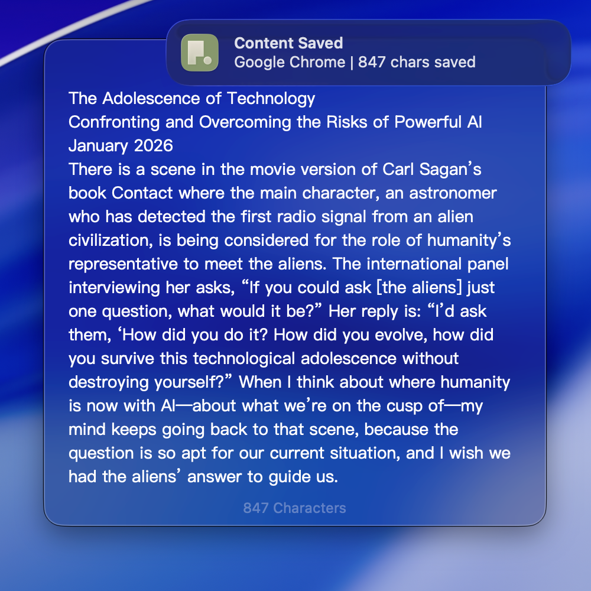

<p align="center">
  
</p>

<h1 align="center">Flint</h1>

<p align="center">
  An open source alternative to Raycast Notes. With full CLI support.
</p>

<p align="center">
  <a href="https://github.com/cyrus-cai/Flint/releases/latest">Download</a> &middot;
  <a href="#features">Features</a> &middot;
  <a href="#building-from-source">Build</a>
</p>

---

<!-- TODO: Add a screenshot or GIF here -->
<!-- <p align="center"></p> -->

## Download

Get the latest release from [GitHub Releases](https://github.com/cyrus-cai/Flint/releases/latest). Download `Flint.zip`, unzip, and drag to Applications.

Requires **macOS 14.6** or later.

## Features

- **Global Hotkey** — Capture a note from anywhere with a single keystroke
- **Double `Cmd+C`** — Auto-save clipboard content as a note
- **CLI** — Create and manage notes from the terminal
- **Local-Only** — All notes stored as plain text files on your machine. No account, no cloud
- **Native macOS** — SwiftUI, menu bar app, Dark / Light / System appearance
- **Integrations** — Apple Reminders, Calendar, and Notes
- **Multilingual** — English, Simplified Chinese, Traditional Chinese

## CLI

<!-- TODO: Add CLI usage and examples -->

```bash
flint "Buy groceries"
flint list
flint search "groceries"
```

## Building from Source

```bash
git clone https://github.com/cyrus-cai/Flint.git
cd Flint
open Flint.xcodeproj
```

Select your development team under **Signing & Capabilities**, then build and run (`Cmd+R`).

**Requirements:** Xcode 16+, macOS 14.6+

## Contributing

Contributions are welcome. Feel free to open issues or submit pull requests.

## Acknowledgments

- [KeyboardShortcuts](https://github.com/sindresorhus/KeyboardShortcuts) — Global hotkey support

## License

[MIT](LICENSE)
