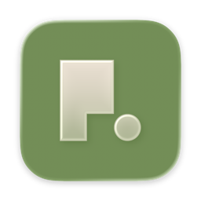
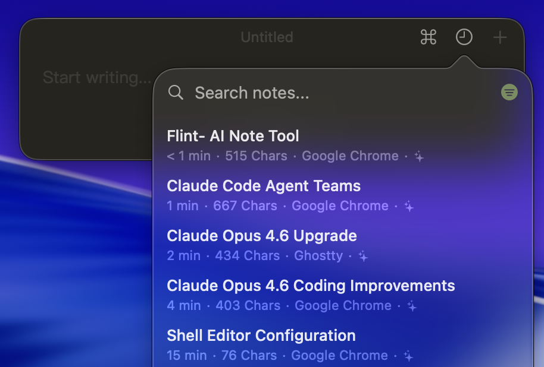
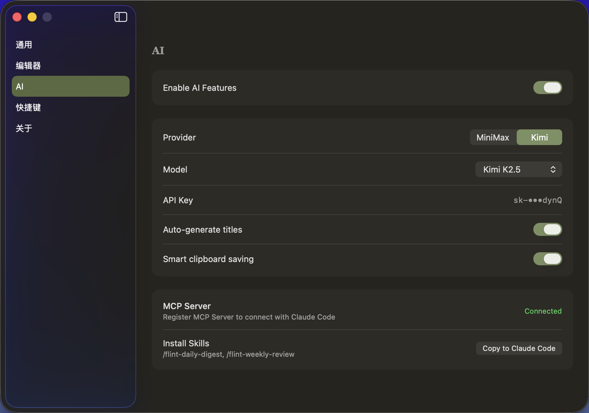
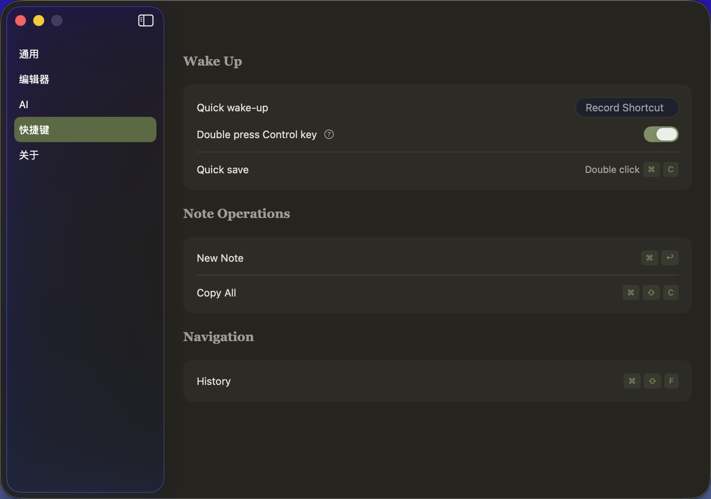
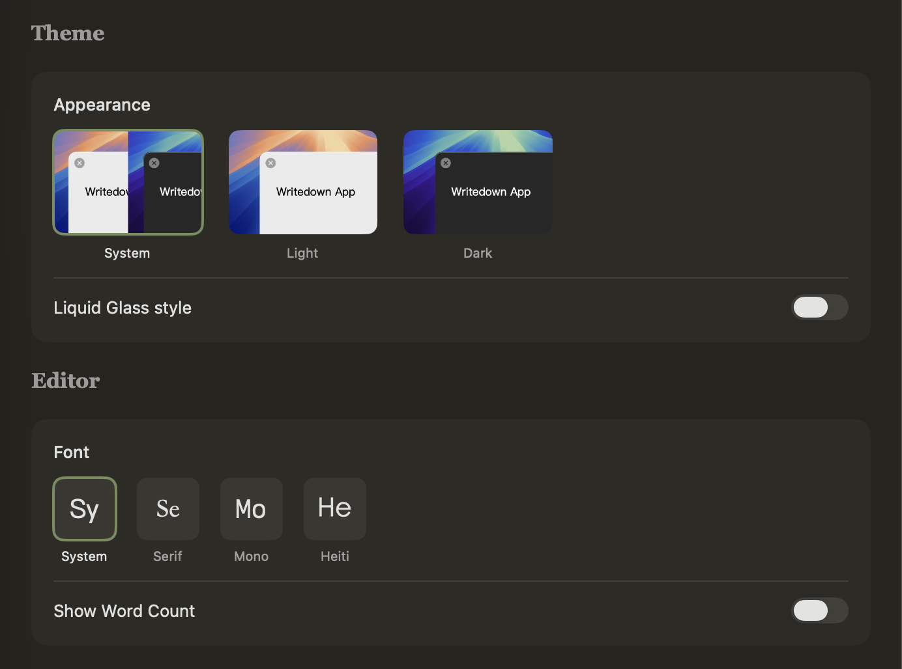

<p align="center">
  
</p>

<h1 align="center">Flint</h1>

<p align="center">
  <b>Opensource alternative to Raycast Note, for humans, for agents.</b><br>
</p>


Flint lives in the background until you need it. Hit a shortcut and a note appears — type, dismiss, done. Copy something twice with `Cmd+C` and it becomes a note automatically. Every note is a plain Markdown file on your machine, no account, no cloud. And because Flint speaks [MCP](https://modelcontextprotocol.io), your AI agent — Claude Code, Cursor, whatever you use — can read, search, and create notes just like you do.

## Features

<table>
<tr>
<td width="50%">

### AI Capture
Every time you press `Cmd+C` — AI decides if it's worth keeping, generates a title, and saves it as a note. No manual sorting, no junk.

</td>
<td width="50%">

</td>
</tr>
<tr>
<td width="50%">

</td>
<td width="50%">

### AI + MCP Native
Built-in AI for titling and smart clipboard. Ships with an MCP server so Claude Code can read, search, and create your notes.

</td>
</tr>
<tr>
<td width="50%">

### Keyboard-First
Every action has a shortcut. Quick wake-up, new note, copy all, navigate history — all without touching the mouse.

</td>
<td width="50%">

</td>
</tr>
<tr>
<td width="50%">

</td>
<td width="50%">

### Make It Yours
System, Light, or Dark theme. Liquid Glass style. Four font families. Your notes live in a folder you choose — works great as an Obsidian vault.

</td>
</tr>
</table>

## Download

```bash
curl -fsSL https://raw.githubusercontent.com/cyrus-cai/Flint/main/scripts/install.sh | bash -s -- --beta
```

## MCP Server

Flint ships with an MCP server (`FlintMCP/`) that exposes your notes to any MCP-compatible AI client.

**Available tools:** `list_notes` · `search_notes` · `read_note` · `create_note` · `edit_note` · `delete_note` · `get_status`

To connect, add the MCP server config in your AI client (Claude Code, Cursor, etc.) — see [MCP documentation](https://modelcontextprotocol.io) for details.

## Building from Source

```bash
git clone https://github.com/cyrus-cai/Flint.git
cd Flint
open Flint.xcodeproj
```

Select your development team under **Signing & Capabilities**, then build and run (`Cmd+R`).

**Requirements:** macOS 15+ · Apple Silicon · Xcode 16+

## License

[MIT](LICENSE)
